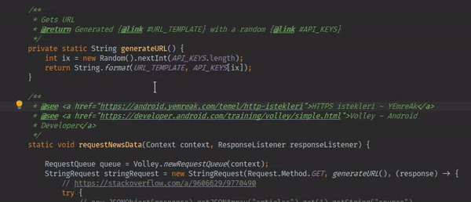

# 📝 JavaDoc

## 🔰 Yapıyı Tanıyalım

* 📝 Metotların hemen üstüne `/**` karakteri ile açılan yorum satırlarıdır
* 📃 Metodun üzerine imleç ile geldiğinizde karşınıza çıkan popup ekranının içeriğini belirler
* 📈 Birden fazla kişinin çalıştığı projelerde kodun anlaşılabilirliğini artırır

> ⏲ Tek çalışıyorsanız da, uzun süre sonra koda baktığınızda hatırlamanızı sağlar

## 👀 Popup Ekrana Bakış



## 🧱 Temel Anahtarlar

| 💎 Anahtar | 📝 Açıklama |
| :--- | :--- |
| `@param` | Metodun aldığı parametreleri açıklar |
| `@return` | Metodun döndürdüğü değeri açıklar |
| `@see <metin>` | Kodu anlamamız için bakmamız gereken alanları gösterir |
| `{@link <metin>}` | Kod ile alakalı değişken, metot ya da class objesi belirtir |


‍🧙‍♂ `@See` anahtarı, html etiketlerini desteklemektedir


```java
/**
 * Gets URL
 * @see <a href="https://android.yemreak.com/temel/http-istekleri">HTTPS istekleri ~ YEmreAk</a>
 * @return Generated {@link #URL_TEMPLATE} with a random {@link #API_KEYS}
 */
private static String generateURL() {
    int ix = new Random().nextInt(API_KEYS.length);
    return String.format(URL_TEMPLATE, API_KEYS[ix]);
}
```

## 🐣 Erişim Operatörleri

* 📌 Class objelerine direkt olarak bağlantı verebilirsin
* 💎 Değişkenlere veya metotlara bağlantı vermek için `#` operatörü kullanılır
* 💠 Metotlar doküman içerisinde prototipleri ile gösterilirler


